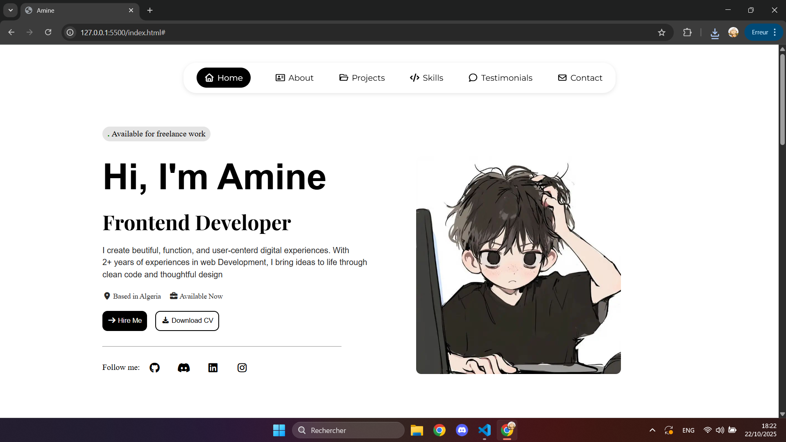

# Portfolio de Tolofon Nelkaël

Portfolio personnel présentant mon profil de développeur frontend et d'analyste cybersécurité junior basé au Bénin.



## Fonctionnalités

- Présentation, services, parcours et projets
- Filtrage des projets par catégorie
- Modale détaillée pour chaque projet
- Thèmes clair et sombre avec mémorisation du choix
- Navigation responsive sur mobile et ordinateur
- Animations au défilement et micro-interactions
- Formulaire de contact avec validation côté interface

## Technologies utilisées

- HTML5
- CSS3
- JavaScript
- Tailwind CSS via CDN
- Font Awesome
- Google Fonts

## Lancer le projet localement

Aucune installation n'est nécessaire.

```bash
git clone https://github.com/neltolofon-dot/Portefolio_v1.git
cd Portefolio_v1
```

Ouvrez ensuite le fichier `index.html` dans votre navigateur.

Pour profiter d'un serveur local, vous pouvez également utiliser l'extension **Live Server** de Visual Studio Code.

## Structure du projet

```text
Portefolio_v1/
├── images/        # Images et aperçus des projets
├── index.html     # Structure et contenu du portfolio
├── script.js      # Interactions et animations
├── styles.css     # Styles personnalisés
└── README.md      # Documentation du projet
```

## Contact

- [GitHub](https://github.com/neltolofon-dot)
- [LinkedIn](https://www.linkedin.com/in/nelka%C3%ABl-tolofon-243443375/)
- E-mail : [tolofonnelkael@gmail.com](mailto:tolofonnelkael@gmail.com)

---

Réalisé par **Tolofon Nelkaël**.
